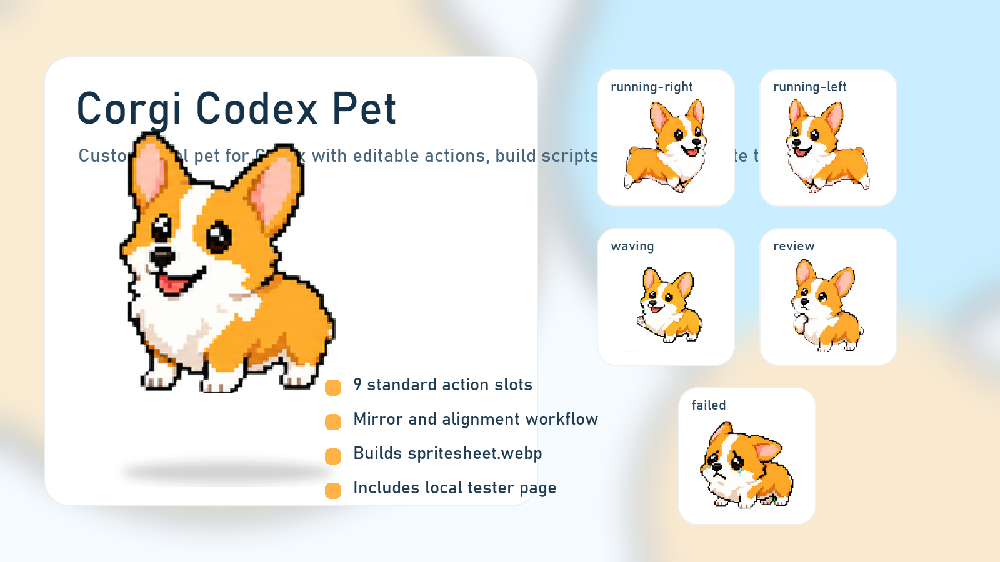
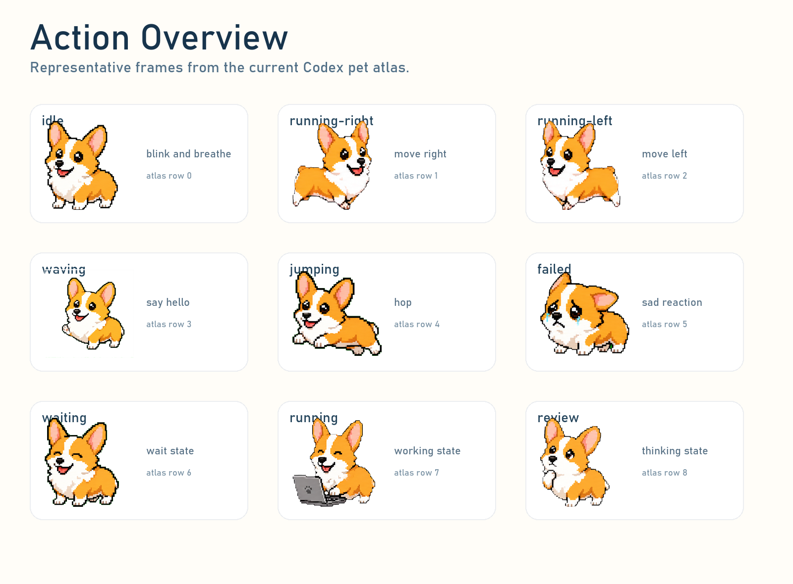
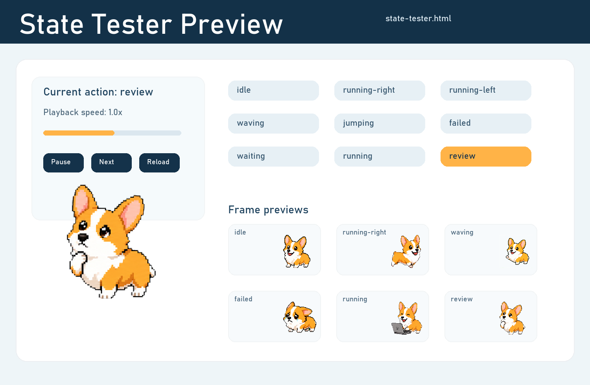

# Corgi Codex Pet

一个可爱的像素风柯基 Codex 宠物项目，包含完整动作素材、可扩展配置、构建脚本，以及本地动作测试页。



## 项目亮点

- 9 个标准动作槽位已经整理完成：`idle`、`running-right`、`running-left`、`waving`、`jumping`、`failed`、`waiting`、`running`、`review`
- 支持替换动作图、镜像动作、单行动作对齐、锁底处理
- 可以从原始动作条重新构建 `spritesheet.webp`
- 自带本地测试页，方便逐个状态检查动画效果
- 最终宠物包已经整理为 Codex 可使用的格式

## 预览

### 动作总览



### 测试页预览



## 仓库内容

- [pet.config.json](pet.config.json)
  动作配置清单，定义动作名称、帧数、素材路径、切帧方式和 atlas 槽位
- [assets/actions](assets/actions)
  原始动作图与参考图
- [scripts/build_pet_package.py](scripts/build_pet_package.py)
  构建最终宠物包与测试页
- [scripts/validate_pet_config.py](scripts/validate_pet_config.py)
  校验配置是否正确
- [scripts/refresh_state_tester.py](scripts/refresh_state_tester.py)
  在你直接修改 atlas 后，刷新测试页使用的图源
- [build/package](build/package)
  最终可分发的宠物包

## 快速开始

### 一键安装到 Codex

Windows 下可以直接双击：

- [install-corgi-pet.bat](install-corgi-pet.bat)

它会自动：

- 读取 [build/package](build/package) 里的最终宠物包
- 识别宠物 id
- 备份你当前已安装的同名宠物
- 覆盖安装到 `~/.codex/pets/<pet-id>`

如果你更喜欢命令行，也可以运行：

```powershell
powershell -ExecutionPolicy Bypass -File scripts/install_to_codex_pet.ps1
```

可选参数：

```powershell
powershell -ExecutionPolicy Bypass -File scripts/install_to_codex_pet.ps1 -SkipBackup
```

### 1. 校验配置

```bash
python scripts/validate_pet_config.py
```

### 2. 构建宠物包

```bash
python scripts/build_pet_package.py
```

构建完成后会生成：

- [build/package/pet.json](build/package/pet.json)
- [build/package/spritesheet.webp](build/package/spritesheet.webp)
- [build/spritesheet.png](build/spritesheet.png)
- [build/state-tester.html](build/state-tester.html)

### 3. 打开本地测试页

直接打开：

- [build/state-tester.html](build/state-tester.html)

你可以在测试页里：

- 切换不同动作状态
- 暂停播放
- 单步查看每一帧
- 调整播放速度
- 检查 atlas 替换后的结果

如果你是直接手改最终 atlas，而不是重新从原始动作图构建，可以运行：

```bash
python scripts/refresh_state_tester.py
```

## 如何替换动作

### 替换已有动作

1. 把对应 PNG 覆盖到 [assets/actions](assets/actions)
2. 保持 `pet.config.json` 里的动作 key 不变
3. 如果帧数或切帧方式变了，同步修改配置
4. 重新运行校验和构建脚本

### 新增动作

1. 把新动作图放到你自己的素材目录
2. 在 [pet.config.json](pet.config.json) 的 `actions` 里新增配置
3. 如果暂时不映射到标准 9 行 atlas，可以先把 `slotIndex` 设为 `null`

## 切帧方式

这个项目支持多种动作条切帧方式：

- `auto-detect-green-screen`
  适合动作之间有明显绿色间隔的图
- `manual-slice-boxes`
  适合动作贴得很紧、需要手工指定每帧横向范围的图
- 等宽切帧
  适合本身已经严格等宽分帧的动作条

## 当前说明

- `running` 是“工作中”动作，使用了笔记本道具
- `review` 是“思考 / 审阅中”动作
- `waiting` 当前仍然偏接近 `idle`，后续还可以继续优化

## 在其他电脑使用

你可以把仓库克隆到其他电脑后，直接使用以下文件：

- [build/package/pet.json](build/package/pet.json)
- [build/package/spritesheet.webp](build/package/spritesheet.webp)

如果你想继续自定义动作，再修改原始素材和配置后重新构建即可。
